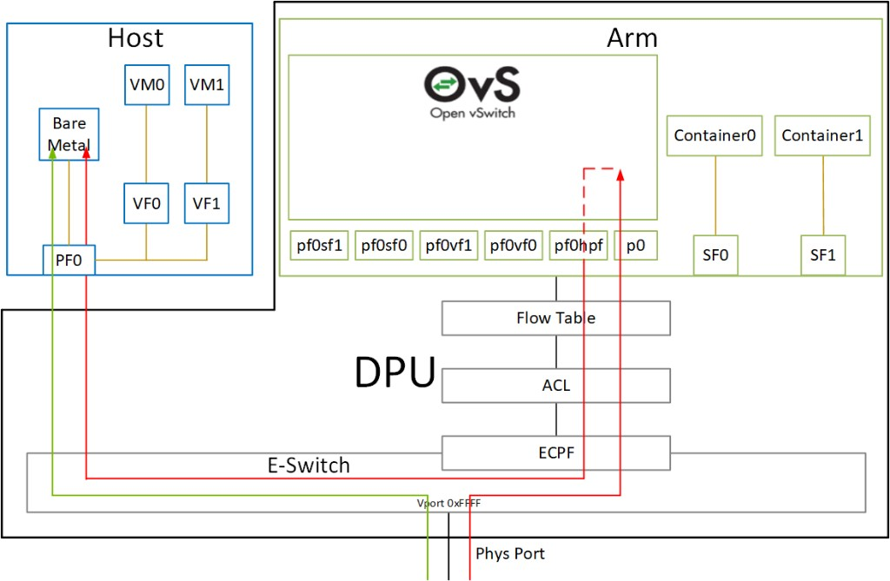

# START HERE — Yash (LFX Intern)

**Package:** OPI Blueprint 003 — Multi-Tenant Network Isolation with OVS Offload (BF3)  
**Sponsor / mentor:** Josh Brooks (WorldTech IT) · Wed **0900–1100** office hours  
**Your job:** Execute Phase **1a** (KVM + OVS-DOCA + vDPA), then **1b** OpenShift Virt best-effort. Evidence in-repo.

Lab access and onboarding are **done**. This tree is the working source of truth until it lands on GitHub.

---

## Drive to this picture



**That** is Phase 1a/1b success: Host VF ↔ Arm OVS representors ↔ E-Switch offload.  
Detail + Blueprint lens: [`docs/architecture/architecture-1a.md`](docs/architecture/architecture-1a.md).  
Guest = stock **virtio-net**; VF = host **DPDK HW vDPA** — not passthrough.

---

## Read in this order (≈45–60 min)

| # | File | Why |
|---|------|-----|
| 1 | This file | Ask + constraints |
| 2 | [`docs/GOALS.md`](docs/GOALS.md) | Weekly north star |
| 3 | [`docs/CHARTER.md`](docs/CHARTER.md) | What we’re building |
| 4 | [`docs/NON_GOALS.md`](docs/NON_GOALS.md) | What **not** to do in v1 |
| 5 | [`docs/SPONSOR_DECISIONS.md`](docs/SPONSOR_DECISIONS.md) | Frozen direction (already decided) |
| 6 | [`docs/ROADMAP.md`](docs/ROADMAP.md) | Gates A' / A / B |
| 7 | [`specs/Intern_JD_OVS_DPU_Offload.md`](specs/Intern_JD_OVS_DPU_Offload.md) | Role scope (v1-aligned) |
| 8 | [`specs/intern-workplan.md`](specs/intern-workplan.md) | What to do next |
| 9 | [`docs/validation/offload-proof-contract.md`](docs/validation/offload-proof-contract.md) | How “offload proven” is defined (**accepted**) |
| 10 | [`docs/validation/limitations.md`](docs/validation/limitations.md) | LM deferred, etc. |
| 11 | [`docs/architecture/architecture-1a.md`](docs/architecture/architecture-1a.md) | Topology — **ASAP² / E-Switch north-star diagram** |
| 11b | [`docs/architecture/vdpa-and-eswitch.md`](docs/architecture/vdpa-and-eswitch.md) | **vDPA vs e-switch ownership** (read if confused) |
| 11c | [`docs/troubleshooting/vdpa-hw-attach.md`](docs/troubleshooting/vdpa-hw-attach.md) | How we attach VMs on that diagram (DPDK HW vDPA) |
| 12 | [`docs/glossary.md`](docs/glossary.md) | Terms |
| 13 | [`docs/KICKOFF_GAPS.md`](docs/KICKOFF_GAPS.md) | What’s still open for execution |

Then use [`specs/deliverables-checklist.md`](specs/deliverables-checklist.md) as your tracker.

---

## The ask (one screen)

**Prove and document** this stack on OPI Lab:

1. BlueField-3 in **DPU mode**  
2. **OVS-DOCA** (not kernel/TC-flower/switchdev as the hero path)  
3. Guests: stock **virtio-net** over **DPDK HW vDPA + vhost-user** (host VF; Arm OVS-DOCA)  
4. **Evidence** that offload is in hardware + a performance baseline  
5. Package as an OPI Blueprint: architecture, BOM, deployment guide + IaC, narrative, validation, partner attribution  

**Then (should happen, best-effort):** same idea under OpenShift Virtualization (DPF + accelerated OVN-K + KubeVirt). Gaps OK if blocked — document them.

---

## Hard constraints (do not violate)

| Do | Don’t |
|----|-------|
| KVM on-ramp (Ubuntu/Debian lab) | Treat OpenShift as required for Gate A |
| OVS-DOCA + DPDK HW vDPA | Ship TC-flower/switchdev as “the” offload proof |
| Document LM as **deferred** (one BF3) | Block Gate A waiting for live migration |
| Intel/Marvell = **targeted later** | Claim multi-vendor validated in v1 |
| Public docs only in git | Commit secrets, VPN creds, or `private/` |
| Evidence for every claim | Slide-ware without logs |

---

## Your next 3 actions

1. **BOM pins from lab** → fill [`docs/bom.md`](docs/bom.md) (DPU mode, FW/BFB, DOCA train, Ubuntu/Debian release).  
2. Read [`docs/troubleshooting/vdpa-hw-attach.md`](docs/troubleshooting/vdpa-hw-attach.md) — do **not** chase kernel `mlx5_vdpa` as the critical path.  
3. **First path-forward evidence** (HW vDPA + OVS-DOCA) → [`docs/validation/results/`](docs/validation/results/); contract is **accepted** — bring questions to Wed office hours.

Full sequence: [`specs/intern-workplan.md`](specs/intern-workplan.md).

---

## Folder map

```
README.md                 Project overview
START_HERE_YASH.md        You are here
docs/                     Direction, goals, validation, architecture, narrative
specs/                    JD, workplan, checklist, onboarding (reference)
artifacts/                Ansible / scripts / manifests (to grow)
references/               Framework FAQ + maintenance
```

---

## People

| Who | Role |
|-----|------|
| **You (Yash)** | Build, evidence, docs/IaC PRs |
| **Josh Brooks** | Direction, mentor, unblock lab/partners |
| **LF / OPI Lab** | Lab + entitlements path |
| **OPI/TSC** | Post-intern maintenance (when published) |

Escalation: access issues → lab admin → Josh if stale. Design “is this offload?” → Josh accept.

---

## Out of your critical path

- Josh’s OPI Summit talk (WTIT) — private; not a Blueprint ticket.  
- LICENSE boilerplate — OPI project norms at publish time.  
- Second-vendor ports and DPU Operator parity — later.

Welcome — keep PRs small and evidence-backed. See you Wednesdays.
