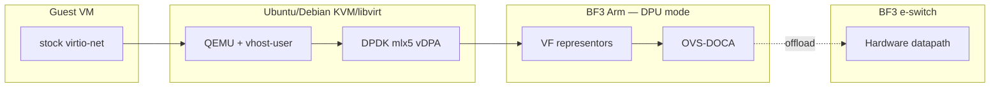

# Phase 1a — Project direction (KVM / Ubuntu·Debian lab)

**Locked:** BF3 DPU mode · **OVS-DOCA** (Arm) · **DPDK HW vDPA + vhost-user** (host) · stock virtio-net guest · prove HW offload · baseline perf · live migration deferred.

This is **direction for the phase**, not a runbook. Execution detail follows after sponsor freeze.

---

## Outcome (“good”)

A platform / virt engineer can **reproduce** a credible OPI reference for **KVM + DPU-offloaded OVS**. Phase 1a proves acceleration; **Phase 1b OpenShift Virt** is the OPI showcase (best-effort bar).

| Outcome | Pass bar |
|--------|----------|
| Architecture | Diagram + trust boundaries (guest / host / DPU Arm / HW datapath) |
| BOM | Exact versions that worked (or closed NEED_LAB gaps) |
| Deployment | Steps or IaC to: DPU mode → OVS-DOCA → HW vDPA guest |
| Offload proof | Flows in hardware (`dp:doca`, `offloaded:yes`), not Arm soft path |
| Perf | Harness + Gbps/pps under stated topology |
| Live migration | Pass on two matching hosts **or** documented deferral with sponsor ack |
| Narrative | What was proven vs deferred |

**Not 1a:** treating OpenShift as required for Gate A; second vendor; full tenant-policy catalog.

---

## Architecture direction

Detail: [`architecture/architecture-1a.md`](architecture/architecture-1a.md) · [`troubleshooting/vdpa-hw-attach.md`](troubleshooting/vdpa-hw-attach.md).

---

## Extra sponsor picks (1a-specific)

1. LM mandatory for 1a publish? **(A)** no if single host · **(B)** yes wait for dual host → **FROZEN: A (defer LM)**  
2. 1a host OS: **(A)** Ubuntu/Debian lab · **(B)** Rocky/RHEL · **(C)** either → **FROZEN: A** (sponsor 2026-09-09)  
3. DOCA: **(A)** latest GA matching BFB · **(B)** LTS · **(C)** freeze lab’s current  
4. Attach: **(A)** DPDK HW vDPA + vhost-user · **(B)** kernel mlx5_vdpa · **(C)** DPU virtio-net emu → **FROZEN: A** (sponsor 2026-09-09)

Record answers in [`SPONSOR_DECISIONS.md`](SPONSOR_DECISIONS.md).
