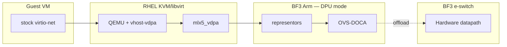

# Phase 1a — Project direction (RHEL / KVM)

**Locked:** BF3 DPU mode · **OVS-DOCA** · guests over **vDPA** (stock virtio-net) · prove HW offload · baseline perf · live migration (or sponsor-deferred).

This is **direction for the phase**, not a runbook. Execution detail follows after sponsor freeze.

---

## Outcome (“good”)

A cloud/platform / hypervisor engineer can **reproduce** a credible OPI reference for **KVM + DPU-offloaded OVS**. RHEL is the validated host OS for that reference—not the product being sold.

| Outcome | Pass bar |
|--------|----------|
| Architecture | Diagram + trust boundaries (guest / host / DPU Arm / HW datapath) |
| BOM | Exact versions that worked (or closed NEED_LAB gaps) |
| Deployment | Steps or IaC to: DPU mode → OVS-DOCA → vDPA guest |
| Offload proof | Flows in hardware (`dp:doca`, `offloaded:yes`), not Arm soft path |
| Perf | Harness + Gbps/pps under stated topology |
| Live migration | Pass on two matching hosts **or** documented deferral with sponsor ack |
| Narrative | What was proven vs deferred |

**Not 1a:** OpenShift/DPF, OVN-K, second vendor, full tenant-policy catalog.

---

## Architecture direction

| Choice | Why |
|--------|-----|
| OVS-DOCA | Locked hero path; DOCA Flow offload; OF surface |
| vDPA + virtio-net | Migration-friendly; guest stays vendor-neutral |
| DPU mode | “Offload to DPU” claim — not host-only switchdev |

**Rejected as primary:** OVS-kernel/TC-flower; OVS-DPDK-only; SR-IOV VF passthrough as the guest model; host switchdev without DPU OVS-DOCA.

---

## Minimum publishable evidence

1. Config: `doca-init` / `hw-offload` / DOCA datapath ports  
2. Mode: OVS shows DOCA active  
3. Flows under load: `dp:doca` + `offloaded:yes`  
4. Counters: HW pkts/pps rise; Arm soft path not dominating  
5. Negative control: offload off → soft path contrast  
6. Guest: stock virtio-net + host vDPA attach  
7. Perf sheet (topology, MTU, pins stated)  
8. LM sheet **or** sponsor-signed deferral  

---

## Defer from 1a

OpenShift Virt / DPF / OVN-K → **1b**  
Deep VXLAN/Geneve / full microseg catalog → later  
Second vendor / DPU Operator parity → later  
DOCA virtio-net as default attach → only if sponsor pivots  

---

## Direction-changing risks

| Risk | Impact | Fork |
|------|--------|------|
| Only one BF3 host | Cannot claim LM | Drop LM from 1a bar or wait for 2nd node |
| Wrong stack defaults to TC/kernel | Wrong story ships | Gate rejects non-DOCA “pass” |
| DOCA/BFB churn | Unreproducible BOM | Pin one train for publish |
| Time cut | Incomplete 1a | Priority: **evidence > docs/BOM > perf > LM** |

---

## BOM stub (pins TBD)

| Item | Status |
|------|--------|
| BF3 DPU mode | Locked |
| RHEL 9 / 10 | **lab-default** — freeze minor from OPI Lab image |
| DOCA / BFB train | **NEED_LAB** then freeze |
| Dual host for LM | **Deferred** this cycle (sponsor: no 2nd BF3) |

---

## Extra sponsor picks (1a-specific)

1. LM mandatory for 1a publish? **(A)** no if single host · **(B)** yes wait for dual host → **FROZEN: A (defer LM)**  
2. RHEL pin (placeholder OS): **(A)** 9 · **(B)** 10 · **(C)** lab-default → **FROZEN: C (9 or 10 from OPI Lab image)**  
3. DOCA: **(A)** latest GA matching BFB · **(B)** LTS · **(C)** freeze lab’s current  
4. Attach freeze: **(A)** host mlx5_vdpa (recommended) · **(B)** pivot to DOCA virtio-net → **ENG DEFAULT: A** (sponsor confirm if different)

Record answers in [`SPONSOR_DECISIONS.md`](SPONSOR_DECISIONS.md) notes or extend that file.
