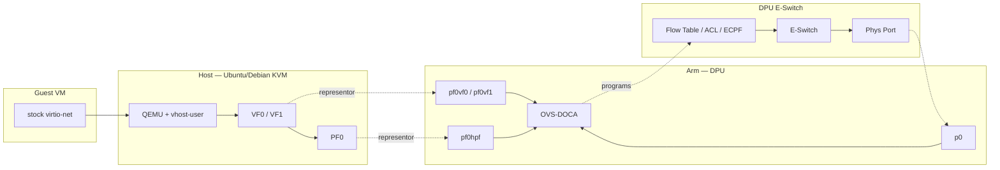

# Phase 1a architecture outline

**North-star topology:** NVIDIA BF3 DPU-mode ASAP² picture — Host VFs ↔ Arm OVS representors ↔ hardware **E-Switch** (Flow Table / ACL / ECPF).

**Locked Phase 1a path (how we attach VMs on that picture):**

Guest stock **virtio-net** → host QEMU **vhost-user** → DPDK **HW vDPA** bound to host **VF** → Arm **`pf0vfN` representor** → **OVS-DOCA** programs Flow Table → **E-Switch** → Phys Port.

---

## How to read the north-star diagram (Blueprint lens)

| Diagram element | Blueprint meaning | Phase 1a? |
|-----------------|-------------------|-----------|
| **Host VM0/VM1 → VF0/VF1 → PF0** | VFs are **host-side** acceleration endpoints for HW vDPA — **not** SR-IOV passthrough into the guest | **Yes** — prove this with stock virtio-net guest |
| **Arm OVS + `pf0vfN` / `pf0hpf` / `p0`** | Representors OVS-DOCA bridges; Arm owns e-switch in DPU mode | **Yes** |
| **Flow Table → ACL → ECPF → E-Switch** | Offloaded datapath once flows are programmed (green/fast path) | **Yes** — contract evidence |
| **Red path via OVS** | Miss / exception / before offload — Arm soft path | **Yes** — use as negative control |
| **Arm Containers → SF0/SF1** | Scalable Functions on DPU | **Later / optional** — not Gate A |
| **Bare Metal on Host → PF0** | Host PF traffic | Context only for 1a |

**Critical honesty:** In the diagram, VMs appear next to VFs. For this Blueprint the **guest still runs stock virtio-net**. The VF is consumed by **DPDK HW vDPA** on the host; the guest must **not** bind the VF (that would be passthrough — contract **fail**).

---

## Trust boundaries

- **Guest:** virtio only  
- **Host:** VM lifecycle + DPDK vDPA on VF + PF  
- **DPU Arm:** OVS-DOCA control plane + representors; **owns e-switch**  
- **HW:** E-Switch forwards established/offloaded flows without Arm soft path  

---

## Phase mapping

| Phase | What we prove on this picture |
|-------|-------------------------------|
| **1a KVM** | VM→VF (via HW vDPA) + OVS-DOCA + offloaded flows on E-Switch |
| **1b OpenShift Virt** | Same datapath pattern under KubeVirt / DPF / OVN-K (**OPI showcase**) |
| **Not v1** | Multi-vendor; Arm container SF story as primary |

---

## Related

- [`vdpa-and-eswitch.md`](vdpa-and-eswitch.md) — vDPA vs e-switch ownership  
- [`../troubleshooting/vdpa-hw-attach.md`](../troubleshooting/vdpa-hw-attach.md) — DPDK attach runbook  
- [`../validation/offload-proof-contract.md`](../validation/offload-proof-contract.md) — pass/fail  

**Export source:** `exports/bf3-dpu-asap2-eswitch.png` (Gate A' / docs freeze).
