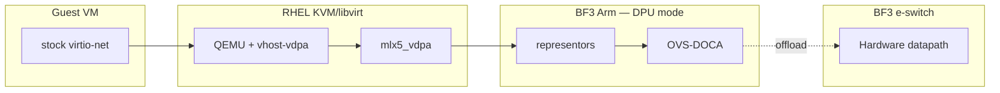

# Phase 1a architecture outline (draft)

**Locked path:** Guest stock virtio-net → host QEMU/`vhost-vdpa` → `mlx5_vdpa` → BF3 representors → **OVS-DOCA** (Arm control) → hardware e-switch → uplink.

**Trust boundaries:** guest sees virtio only · host owns VM/vDPA lifecycle · DPU Arm owns OVS control **and e-switch** (DPU mode) · HW forwards established flows without Arm soft path.

**Confused about vDPA vs e-switch?** Read [`vdpa-and-eswitch.md`](vdpa-and-eswitch.md).

**Not primary:** OVS-kernel/TC-flower/switchdev · VF passthrough as the guest model.

**Export:** freeze PNG/SVG under `exports/` before 15 Oct Summit slide 3.
