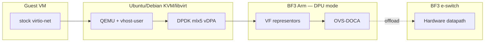

# Phase 1a architecture outline (draft)

**Locked path:** Guest stock virtio-net → host QEMU **vhost-user** → DPDK **HW vDPA** (host VF) → Arm VF representor → **OVS-DOCA** → hardware e-switch → uplink.

**Trust boundaries:** guest sees virtio only · host owns VM + DPDK vDPA lifecycle · DPU Arm owns OVS control **and e-switch** (DPU mode) · HW forwards established flows without Arm soft path.

**Confused about vDPA vs e-switch?** Read [`vdpa-and-eswitch.md`](vdpa-and-eswitch.md).  
**Kernel mlx5_vdpa dead-end under DOCA?** See [`../troubleshooting/vdpa-hw-attach.md`](../troubleshooting/vdpa-hw-attach.md).

**Not primary:** OVS-kernel/TC-flower/switchdev · VF passthrough as the guest model · kernel `vhost-vdpa` under DOCA-Host.

**Export:** freeze PNG/SVG under `exports/` for Gate A' / Blueprint docs (mid-Oct).
